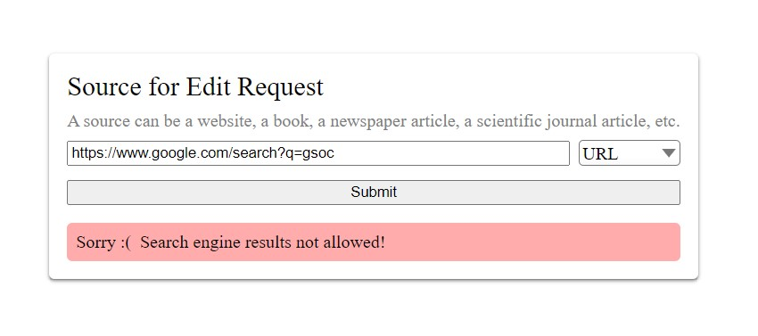
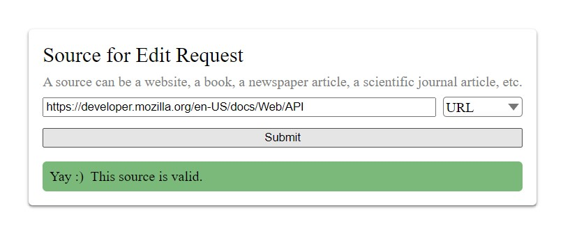
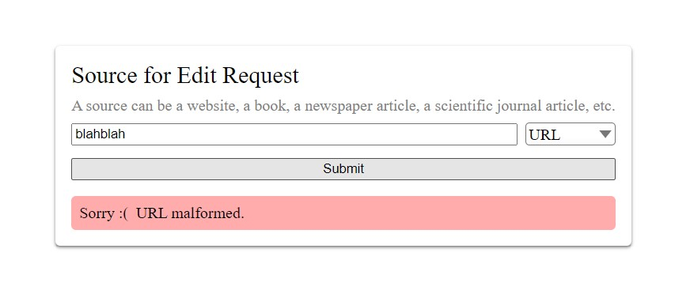

> ### Microtask 2
> Design a form input that allows the user to input a source. A source is a document that's used for evidence. We will (usually) require the user to provide a source with their edit request. A source can be a website, a book, a newspaper article, a scientific journal article, or any number of other things. Design a form that will allow the user to provide a source. At minimum, the user should be able to provide a website (URL) or a book (ISBN) as input. As a bonus, imagine how your form would display the feedback that the source was unreliable. You can submit your design using any method you want: for example, describing it in text, implementing it using some mockup tool like Figma, or drawing it using Paint. You may also implement it in code, but that's not required. Reason for this task: we don't have a designer on this project, so we'll be designing the interfaces together.

For this task I created a basic Source Field for a form using plain HTML, CSS and jQuery (no CSS or UI libraries were used!).

As a bonus, this form can be used to query and test my [Microtask 4 (URL Validation)](https://github.com/anirudhgray/wikimedia-microtask-4) submission.

## Screenshots

